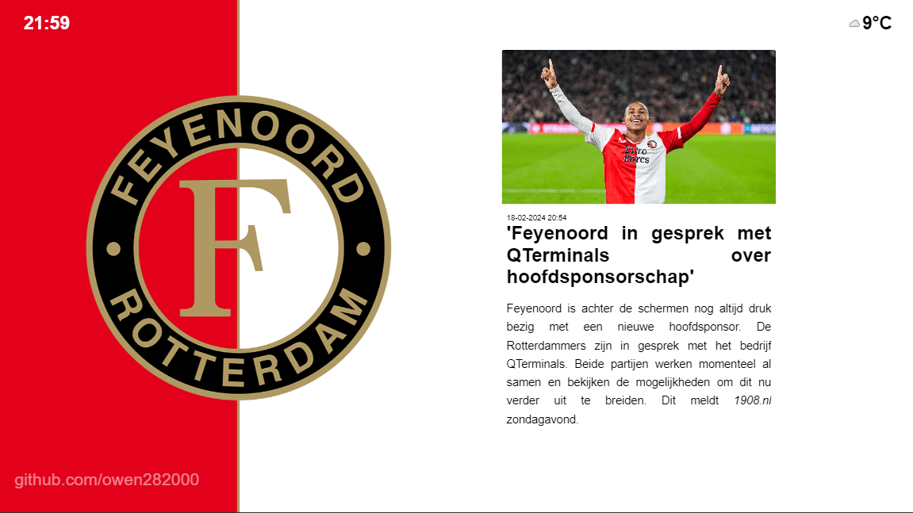

# Feyenoord News Dashboard

To run this project, run the following and go to http://localhost:3000


## Run Locally

Clone the project

```bash
  git clone https://github.com/owen282000/feyenoord_news_dashboard.git
```

Go to the project directory

```bash
  cd feyenoord_news_dashboard
```

Create container

```bash
  docker build -t feyenoord-news-display .
```

Start container on port 3000

```bash
  docker run -p 80:3000 -e WEATHER_API_KEY=your_api_key_ --name fnd -d feyenoord-news-display
```

## Environment Variables

To run this project, you can set the following environment variables in Docker: 

`WEATHER_API_KEY` - `required` - retrieve from https://www.weatherapi.com/

`PORT` - `optional` - `default` `3000` - set another listening port withing the container 
\
(if changed, change the port in the docker command and Dockerfile accordingly)

## Accessable Links

Main news board

```bash
  http://localhost:80
```
    
FR12 RSS Feed Clone

```bash
  http://localhost:80/rss
```
    
FR12 Article Clone

```bash
  http://localhost:80/get-article-content?url=...
  http://localhost:80/get-article-content?url=https://www.fr12.nl/nieuws/lukaku-sprak-met-karsdorp-feyenoord-speelt-heel-goed
```
    
Weather Article Clone

```bash
  http://localhost:80/weather?city=...
  http://localhost:80/weather?city=rotterdam
```
    